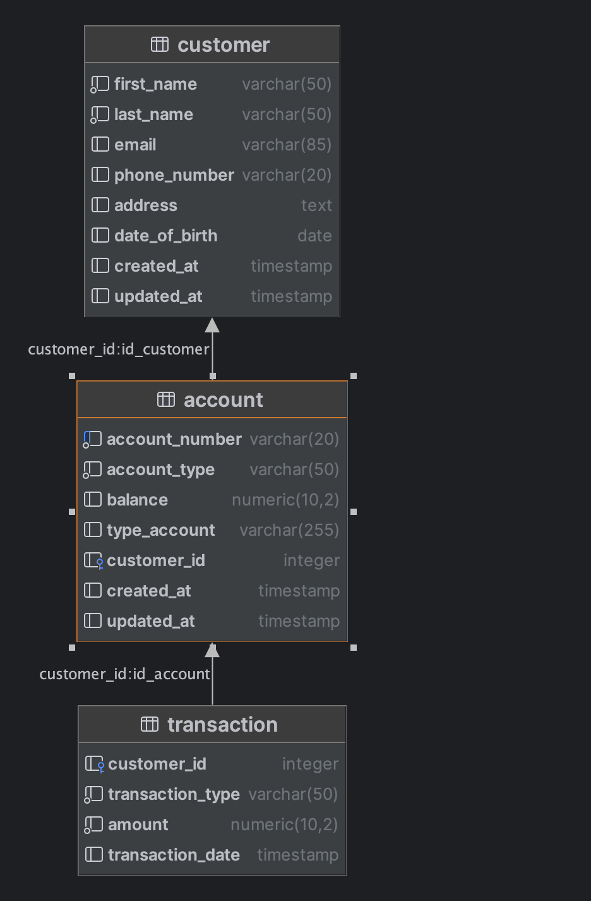

  <h1>📕 Basic Banking System</h1>
  <strong>Backend Javascript Challange 03</strong> 🥳

 

## Skill Metrics

Kemampuan teknis yang akan dipelajari

- Database
- DBMS (Database Management System)
- Query Language
- Database Indexing and Query Optimization
- RDBMS

## Studi Kasus Challange03

Sebuah bank ingin membuat sistem untuk melacak informasi nasabah, akun, dan transaksi mereka. Mereka ingin kamu merancang database yang sesuai dengan kebutuhan mereka.

## Entitas:

- Nasabah (customer)
- Akun (account)
- Transaksi (transaction)

## Relasi

- Satu Nasabah dapat memiliki beberapa Akun, tetapi setiap Akun hanya dimiliki oleh satu Nasabah

- Satu Akun dapat memiliki banyak Transaksi, tetapi setiap Transaksi hanya terkait dengan satu Akun.

## Gambar ERD dari perintah create_and_insert.sql

