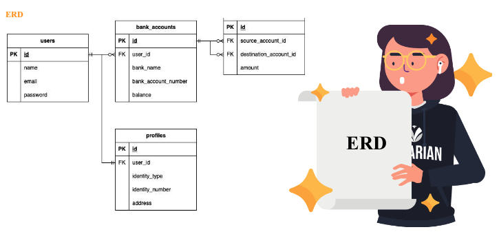

  <h1>📕 Basic Banking System</h1>
  <strong>Backend Javascript Challange 4</strong> 🥳

 

## Skill Metrics

Kemampuan teknis yang akan dipelajari

- NodeJS
- Package Management
- ExpressJS
- ORM with Prisma

## Criteria

1. Membuat API menggunakan Express JS
2. Melakukan CRUD kedalam database menggunakan Prisma
3. Mampu menggunakan JSON

## Studi Kasus

Pada challange chapter empat ini, saya akan mengintegrasikan Express.js dan Prisma.js ke dalam "Basic banking system"

## Entity Relationship Diagram

## Relations

1. Setiap User dapat memiliki banyak account (one to many antara **Users** dan Bank **Accounts**).
2. Setiap Akun hanya dimiliki oleh satu User (many to one antara **Bank Accounts** dan **Users**).
3. Setiap User hanya memiliki satu Profile (one to one antara **Users** dan **Profiles**)
4. Setiap Profile hanya dimiliki oleh satu User (one to one antara **Profiles** dan **Users**)
5. Setiap Akun dapat memiliki banyak Transaksi (many to many antara **Bank Accounts** dan **Bank Accounts** melalui table penampung **Transactions**).
